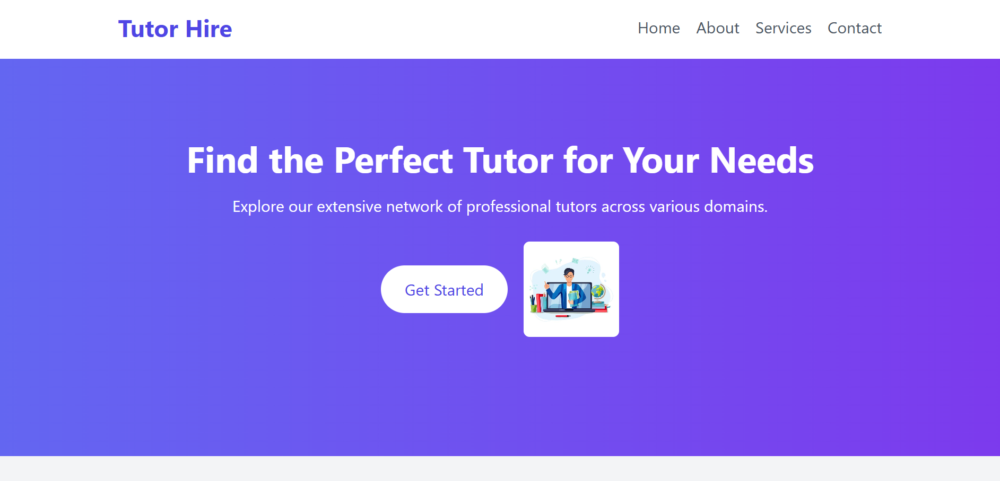
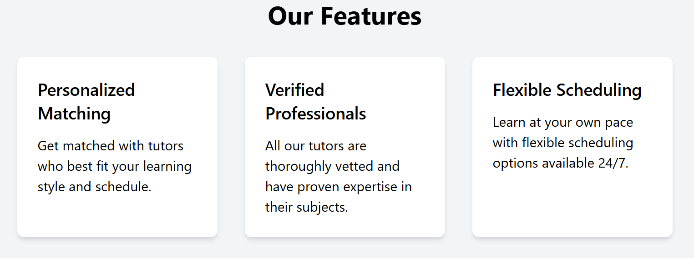
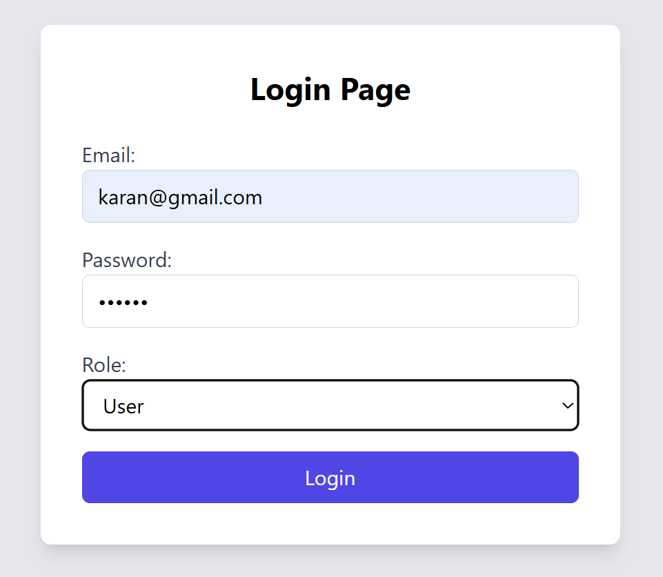
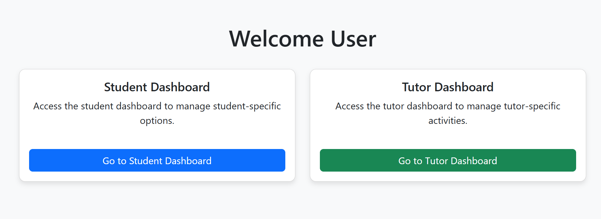
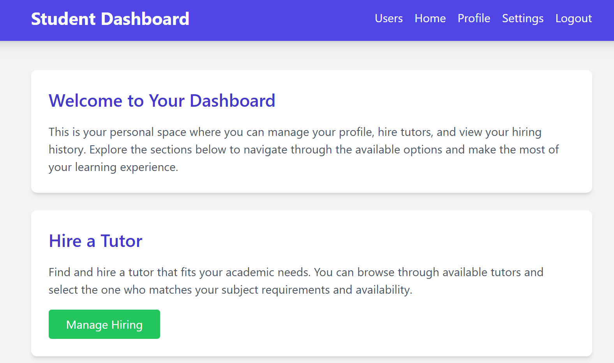
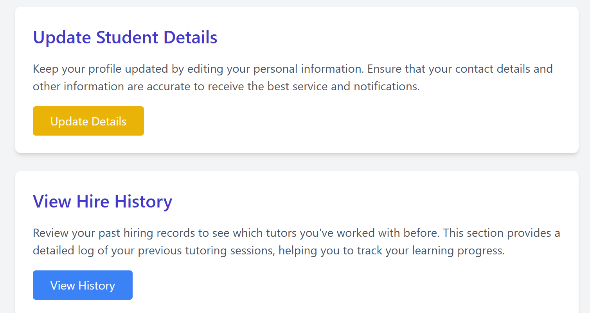
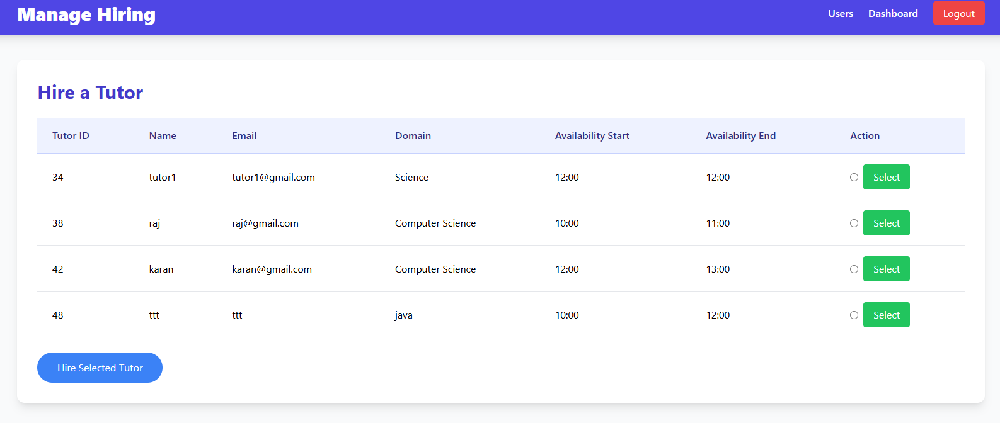
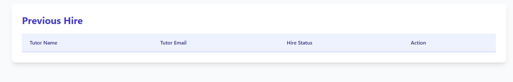
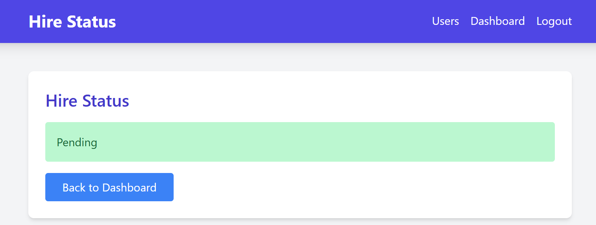

# WebApp-Hire-A-Tutor-For-Free

## Overview
This project is a collaborative learning platform where users can post their doubts and get help from other users. Users who clear doubts receive points that increase their ranking on the platform. The platform offers an easy way to connect users with tutors for hire.

## Features
- User Registration and Profiles
- Posting Doubts and Questions
- Matching Users with Tutors
- Creating Meeting Rooms (via Google Meet or Zoom API)
- Points and Ranking System
- Managing Hiring and Tutor Approvals

## Tech Stack
- **Frontend:** Angular/React.js, HTML, CSS, JavaScript
- **Backend:** Spring Boot with Spring MVC and Spring Security
- **Database:** MySQL or PostgreSQL with Hibernate and JPA
- **Authentication:** JWT or OAuth
- **Video Conferencing API:** Google Meet API, Zoom API
- **Hosting:** AWS, Heroku, or DigitalOcean

## Progress

### 1. Dashboard Overview
The dashboard gives users an overview of their activities, current points, and tutor recommendations.




*Features Highlighted:*
- Overview of tutor hiring options.
- Easy access to user statistics and points.

---

### 2. Login Page
The login page allows users to access the platform, ensuring secure authentication using JWT or OAuth. The user-friendly interface makes logging in quick and intuitive.



---

### 3. User Dashboard
Once logged in, users have access to their personalized dashboard. Here, users can manage their profiles, view doubts they have posted, and see their progress.



*Features Highlighted:*
- Profile management.
- View doubts posted and resolved.

---

### 4. Student Dashboard
This section is tailored for students looking to hire tutors. The dashboard provides a list of available tutors and allows users to easily manage their hiring requests.




*Features Highlighted:*
- Browse and hire tutors.
- View current and past tutor requests.

---

### 5. Hire Dashboard
This dashboard displays the status of tutor hiring. Users can view pending hires, confirmed tutors, and the status of ongoing requests.




*Features Highlighted:*
- Manage tutor hires, including viewing previously hired tutors.
- Track the status of current and past hires.

---

### 6. Hire Status Updates
This section shows the status of tutor hires, including updates on pending, confirmed, or cancelled requests. It reflects the real-time status of each hire as the tutor approves or cancels the request.



*Features Highlighted:*
- Real-time updates for tutor hire status (Pending, Confirmed, Cancelled).
- Easy-to-follow status changes for users.

---

## Tasks

### 1. Planning and Design
- [x] Define overall architecture and technologies
- [x] Design user interface and user experience
- [x] Create wireframes and prototypes

### 2. Backend Development
- [x] Set up a Spring Boot project
- [x] Create database schema for users, doubts, meetings, and points using Hibernate and JPA
- [x] Develop RESTful APIs for communication between frontend and backend

### 3. Frontend Development
- [x] Set up a frontend project using Angular/React
- [x] Develop components for user registration, login, doubt posting, and profile viewing
- [x] Implement responsive design for accessibility on various devices

### 4. User Authentication
- [x] Implement user registration and login endpoints in Spring Boot
- [x] Secure authentication using Spring Security and JWT or OAuth

### 5. Doubt Posting and Matching
- [x] Implement functionality for posting doubts with categories
- [x] Develop a matching algorithm to match users with suitable helpers
- [x] Create API endpoints for doubt posting and matching

### 6. Meeting Room Integration
- [x] Integrate Google Meet API for creating meeting links
- [ ] Provide users with the option to choose internal or external communication platforms

### 7. Points and Ranking System
- [x] Create an API endpoint for confirming doubt clearance
- [x] Update user points and ranking in the database
- [x] Display points and rankings on user profiles

### 8. Testing
- [ ] Conduct unit testing for backend services
- [ ] Conduct unit testing for frontend components
- [ ] Perform end-to-end testing to ensure all features work seamlessly

### 9. Deployment
- [ ] Deploy the application to a cloud service (AWS, Heroku, or DigitalOcean)
- [ ] Ensure scalability and handle potential user load

### 10. Maintenance and Updates
- [ ] Regularly update the platform with new features and improvements
- [ ] Monitor the system for any issues and ensure smooth operation

## Getting Started

### Prerequisites
- Java Development Kit (JDK)
- tomcat v10.1 server , Eclipse IDE.
- MySQL or PostgreSQ
- Google Cloud account for Google Meet API

### Setting Up Backend
1. Clone the repository:
   ```bash
   git clone https://github.com/codedeprived/WebApp-Hire-A-Tutor-For-Free.git
